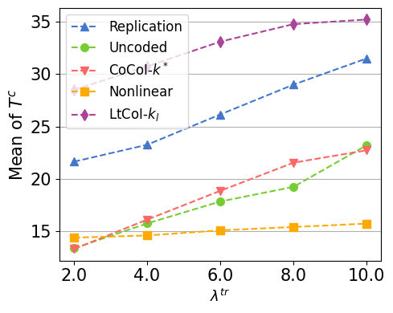
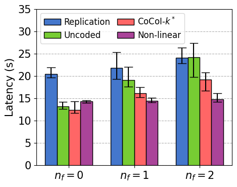
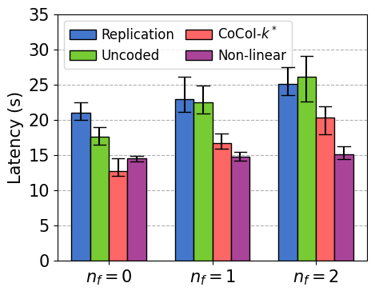
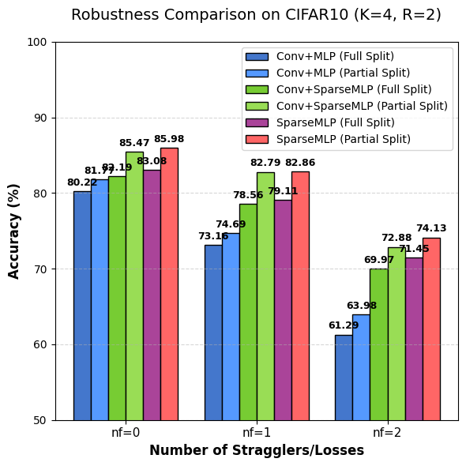
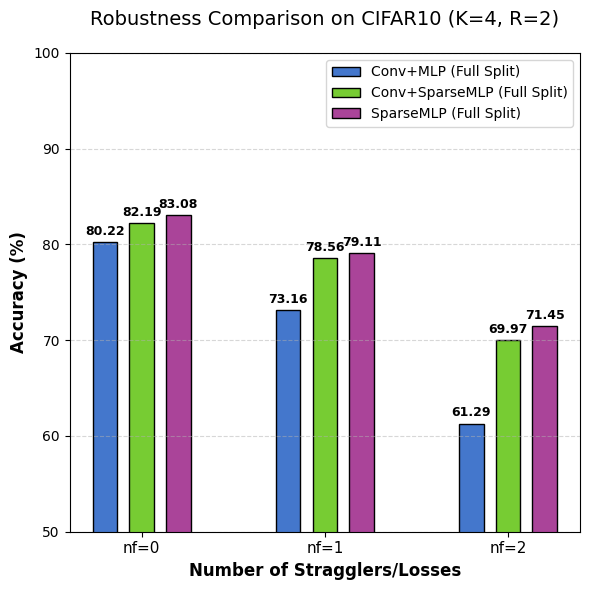
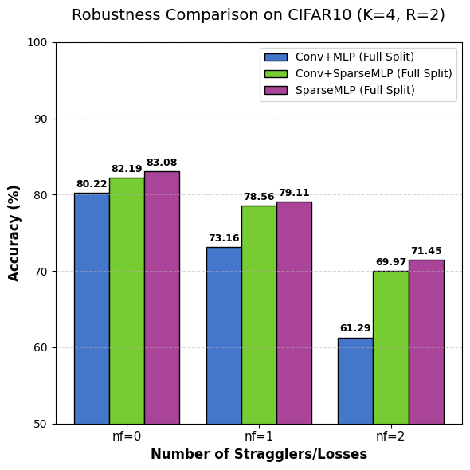
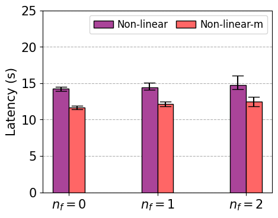
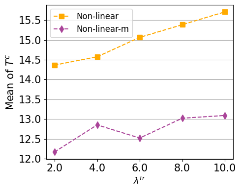

Compared to treating individual convolutional layers or the entire CNN as the encoding unit, partitioning the network into \textit{conv blocks} for distributed coded computation achieves a better trade-off between computational and communication overhead. Due to the local dependency of convolution where each element in the output feature map depends only on a local region of the input, subtask partitioning based on output feature maps naturally introduces overlapping between the corresponding input partitions. If the entire CNN is treated as a single unit for partitioning, such distributed inference method has the minimal communication overhead, the cascading effect of too many stacked convolutional layers leads to significant overlapping between the intermediated results in the shallow layers of CNNs, bringing large redundancy computation overhead between the fused-layer subtasks. On the other hand, decomposing ecah individual convolutional layer independently eliminates redundant computation overhead, but it introduces frequent inter-device synchronizations, leading to high communication overhead. 

Therefore, to strike a better balance between computation and communication in distributed inference, we propose partitioning the convolutional layers of CNN into \textit{conv blocks} as the minimal unit for distributed coded computation.
<!-- % 这里是否可以用数值指标说明？ -->
We observe that pooling layers are a major source of the increasing overlapping across input partitions of original split subtasks. \rev{Specifically, pooling operations expands the receptive field of subsequent layers, thereby increasing the dependency range of output partitions on the input.} Based on this insight, we partition CNN into multiple \textit{conv blocks} separated by pooling layers.

Each \textit{conv block} consists of multiple convolution layers, along with their associated activation functions and normalization layers. Notably, BatchNorm is essentially equivalent to a linear transform. Together with activation function, they perform element-wise operations that do not alter the input-output dependency structure. Referring to the previously mentioned notations, we define the input feature map of a \textit{conv block} as $\mathbf{I}\in\mathbb{R}^{B\times C_\text{I}\times H_\text{I}\times W_\text{I}}$. Give the shape of the block input $\mathbf{I}$, we can determine the shape of the block output $\mathbf{O}\in\mathbb{R}^{B\times C_\text{O}\times H_\text{O}\times W_\text{O}}$ based on the configuration of convolutional layers within the block and equation \eqref{eq:input-output}. Following a similar approach as in prior work, we partition the expected output $\mathbf{O}$ along the width dimension into $k$ partitions $\mathbf{Y}_1,\dots,\mathbf{Y}_k$, each serves as the target output of an original subtask. Similarly, an output partition $\mathbf{Y}_i$ ($i\in[n]$) is defined by a range $(a_\text{O}, b_\text{O})$ along the width dimension of $\mathbf{O}$, with $a_\text{O}\geq 0$ and $b_\text{O}\leq W_\text{O}$. For an output partition $\mathbf{Y}_i$ with range $(a_\text{O}, b_\text{O})$, we can determined the corresponding partition range $(a_\text{I}, b_\text{I})$ associated with the required input partition $\mathbf{X}_i$ within the original block input $\mathbf{I}$ by iteratively computing the input range of the previous layer using equation \eqref{eq:output-input} backwards.

By applying this process to all output partitions, we decompose a \textit{conv block} into $k$ parallelizable subtasks, each associated with a matched input-output pair of equal size. This subtask partitioning strategy enables efficient and balanced distributed execution of CNN inference, while maintaining a nice trade-off for both computational redundancy and communication overhead.

\subsection{Encoder and Decoder}

Encoding and Decoding

To generate redundant subtasks based on the original split subtasks of a \textit{conv blocks}, we introduce specially designed encoder-decoder pair using \textit{sparseMLP}. In general, the encoder takes $k$ equal-size split input partitions 

$\mathbf{X}_1,\dots,\mathbf{X}_k$ of the \textit{conv block} as input and generates $r$ encoded input partitions 
$\Tilde{\mathbf{X}_1},\dots,\Tilde{\mathbf{X}_r}$, each of them has a shape of $(B,C_\text{I},H_\text{I},W^p_\text{I})$ due to the partition on the width dimension.

As for the decoder, we need a unified decoding scheme to handle different struggler cases of the subtask execution. Specifically, strugglers may occur to various number and different individual block subtasks. Therefore, the decoder takes $k+r$ encoded output partitions $\mathbf{Y}_1,\dots,\mathbf{Y}_k$ and $\Tilde{\mathbf{Y}_1},\dots,\Tilde{\mathbf{Y}_r}$ as input, each with shape $(B,C_\text{O},H_\text{O},W^p_\text{O})$, and generates the decoded output feature map of size $(B,C_\text{O},H_\text{O},W_\text{O})$, served as the block output $\mathbf{O}$. When some stragglers occur, the corresponding subtask outputs fed to the decoder are transformed to all-zero tensor, therefore the decoder does not obtain any information about the desired output corresponding to the straggler subtasks. Similar settings are also adopted in \cite{Kosaian2020learningbased}.

\textbf{Architecture of Encoder and Decoder.} Encoder composed of multiple convolutional layers (conv encoder) and decoder based on MLP (mlp decoder) have been proposed to approximate a non-linear erasure code to encode multiple CNN inference tasks \cite{Kosaian2020learningbased}. However, such design leads to inefficient coded inference in edge scenarios, especially for block-wise encoding. Specifically, the high FLOPs encoding through conv encoder leads to significant encoding overhead. While the MLP encoder/decoder necessitate a large scale of parameters to encode the intermediate \textit{conv blocks} due to the large intermediate results, even larger than the original CNN model, accounting for too much memory resources.

While linear erasure codes essentially perform simple linear transform with the input symbols, which motivates us that a non-linear erasure code may not need the full mapping from all element of the input symbols. To this end, we propose \textit{sparseMLP} encoder/decoder that incorporates the expressiveness of MLP and the weight-sharing feature of convolutional layers. A \textit{sparseMLP} encoder/decoder consists of multiple \textit{sparse-linear} layers, which specifies the output size of the encoder/decoder. Different from convolutional layers, a \textit{sparse-linear} layer applies different weight to compute the output of different positions (i.e., computing )

\textbf{Training Encoder-Decoder Pairs.} We simulate the straggling effects during the training of encoder-decoder pairs.

<!-- % encoder就是原本的conv decoder
% 注意描述decoder的构造 -->

## Latency & Robustness
x

<!-- TODO: 趋势有点奇怪可能要重新跑一下？

不确定lambda-tr的范围，原文中是0.2-1，代码中是2-10？ -->

Fig. 8 shows the CNN inference latency in scenario-1

When $\lambda^{tr}$ is small (e.g., $\lambda^{tr} = 2$), “Uncoded” and CoCol-$k^*$ are slightly faster than Nonlinear due to the additional computational overhead of the neural encoder/decoder at each worker. However, under a moderate degree of straggling effect (e.g., $\lambda^{tr} \ge 4$), the proposed Nonlinear scheme significantly outperforms the linear benchmarks due to its high stability against transmission delays. The latency reduction can be up to 32.6% when $\lambda^{tr} = 10$ compared to the Uncoded scheme (and 50% compared to Replication). 

we evaluate the performance of our proposed non-linear coded inference framework. Unlike linear approaches that ensure perfect recovery, the non-linear scheme trades off a marginal drop in inference accuracy for superior latency stability in highly volatile environments.
<!-- 加入随即延迟不敏感 lambda-tr从2到10，其他方法的延迟显著上升 ，Non-linear延迟仅从约 14s 增至 15s 左右。-->
<!-- 对落后节点鲁棒性高，利用已到达的任意分片进行近似恢复 -->

<!-- We compared the inference latency of the Non-linear scheme against Replication, Uncoded, and CoCoI-$k^*$ benchmarks under varying degrees of straggling effects ($\lambda^{tr}$) and device failures ($n_f$).

As $\lambda^{tr}$ increases from 2 to 10, implying severe transmission delays, the latency of CoCoI-$k^*$ and Replication schemes increases linearly. In contrast, the latency of the Non-linear scheme remains quasi-constant (around 14-15s). -->

<!-- 设备故障下的稳定性 -->
<!-- 非线性编码引入额外的Encoder/Decoder推理开销 （nf=0）-->
<!-- 故障情况下Non-linear略微增加 保持在15s左右，原因同上 -->

Fig. 9 presents the inference latency comparison under device failure scenarios ($n_f = 0, 1, 2$). The error bars indicate the variance of the inference latency. When there is no device failure ($n_f = 0$), the proposed Non-linear scheme is slightly slower than CoCoI-$k^*$ and “Uncoded” benchmarks. This is attributed to the additional computational overhead introduced by the neural encoder and decoder inference. However, as $n_f$ increases from 0 to 2, the latency of “Uncoded” and Replication significantly deteriorates, increasing noticeable due to the necessary re-transmission or waiting for replicas. While CoCoI-$k^*$ mitigates this rise better than the baselines, it still exhibits a noticeable latency increase as it waits for the $k$-th fastest result. In contrast, the Non-linear scheme demonstrates superior robustness; its latency remains  around 15s regardless of the number of failures. Unlike linear codes which rely on exact reconstruction, the Non-linear approach effectively approximates the output using available partitions, eliminating the need for re-execution. Consequently, the Non-linear scheme achieves the most stable performance with negligible variance (indicated by the minimal error bars). When compared to the “Uncoded” and Replication baselines under severe failure conditions ($n_f=2$), the Non-linear approach reduces inference latency by up to 37.5%.

<!-- Under failure scenarios ($n_f=1$ and $n_f=2$), the Non-linear scheme maintains a stable latency profile, outperforming the Uncoded scheme by significant margins (up to $\approx 40\%$ reduction at $n_f=2$). While it incurs a slight overhead compared to the Uncoded method when no failures occur ($n_f=0$), this cost is negligible compared to the gains in reliability.

As failures occur ($n_f=1, 2$), the Uncoded scheme suffers fromsignificant re-transmission or re-allocation delays. TheNon-linear scheme, however, remains stable. Even with $n_f=2$(two workers failing completely), the Non-linear approachachieves an inference latency approximately 40% lower than theReplication scheme. This confirms that the Non-linear frameworkeffectively eliminates the need for time-consumingre-computations by approximating the missing data via thetrained decoder. -->

<!-- 方差较小：通信次数更少，稳定度高 -->

## Accuracy/Encoder/Decoder

<!-- 近似计算的精度 SparseMLP表现最好的架构-->

部分切割部分？

<!-- Partial Split配合 SparseMLP 在丢失发生时能维持更高的精度 -->
<!-- While accuracy degradation occurs as the number of lost partitions "Loss Num" increases, the "Partial Split" strategy combined with SparseMLP mitigates this drop effectively compared to the "Full Split" approach. -->

直接比较全切割的
<!--  -->

Fig. 9 compares the inference accuracy of three encoder-decoder configurations (Conv+MLP, Conv+SparseMLP, and pure SparseMLP) under varying partition loss scenarios ($n_f=0, 1, 2$). In the failure-free scenario ($n_f=0$), the SparseMLP architecture achieves the highest baseline accuracy of 83.08%, slightly outperforming Conv+SparseMLP (82.19%) and Conv+MLP (80.22%), indicating effective information preservation. As the number of stragglers increases, the advantage of the SparseMLP-based designs becomes more pronounced. This validating that the SparseMLP decoder significantly enhances feature map recovery when significant partitions are missing.

